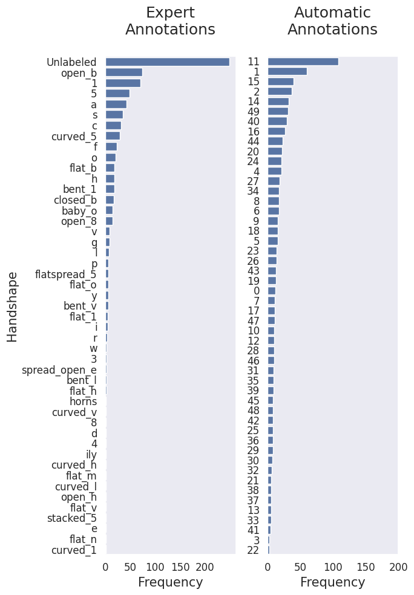
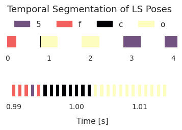
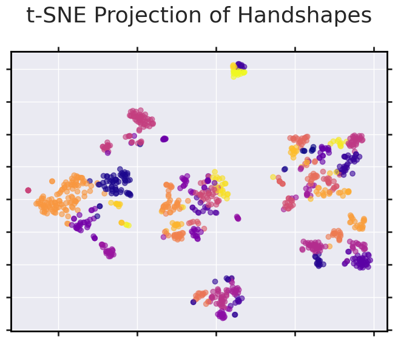

# 3D-LEX Semi-Automatic Annotation of Phonemes in Sign Language

This repository contains the code to perform semi-autmatic annotations of phonetic properties based on the 3D-LEX dataset, and to reproduce the results of the paper: _3D-LEX v1.0: 3D Lexicons for American Sign Language and Sign Language of the Netherlands_.

Experiments currently available for the following phonetic classes:

    Handshapes


<table style="border-collapse: collapse; border: none;">
<tr>
<td style="border: none;">




</td>
<td style="border: none;">

<span style="font-weight: bold;">Distribution of Handshape labels</span>

This figure showcases the distribution of new handshape labels produced using a k-means clustering algorithm on the StretchSense glove data for 1000 glosses, as compared to the distribution of handshape labels provided by expert linguists (ASL-LEX 2.0).

</td>
</tr>
</table>
<br>

<table style="border-collapse: collapse; border: none;">
<tr>
<td style="border: none;">




</td>
<td style="border: none;">


<p><strong>Time-series visualization of handshape classification:</strong><br> Classification of the ASL sign "<em>zero</em>" with expert label "<em>o</em>". The bars denote captured frames, triggered by positional shifts, with colors denoting handshapes identified by the Euclidean distance method. Our segmentation pipeline identifies handshapes "<em>5</em>", "<em>f</em>", "<em>c</em>", and "<em>o</em>", selecting frames corresponding to "<em>o</em>" as the characteristic signal of "<em>zero</em>".</p>


</td>
</tr>
</table> <br>

<table style="border-collapse: collapse; border: none;">
<tr>
<td style="border: none;">




</td>
<td style="border: none;">

<strong>t-SNE projection</strong>:<br> A projection of average hand poses to two dimensions from the selected temporal ranges, color-coded with a k(=50)-means cluster label for visualization purposes.


</td>
</tr>
</table>
<br><br>

### Evaluation on the isolated sign recognition task

<table>
  <thead>
    <tr>
      <th><i>a</i><sub>1</sub><sup>N</sup></th>
      <th><i>a</i><sub>1</sub><sup>E</sup></th>
      <th><i>a</i><sub>1</sub><sup>A</sup></th>
    </tr>
  </thead>
  <tbody>
    <tr>
      <td>0.44<sub>&plusmn;0.01</sub></td>
      <td>0.48<sub>&plusmn;0.01</sub></td>
      <td><strong>0.49<sub>&plusmn;0.01</sub></strong></td>
    </tr>
  </tbody>
</table>
<p><strong>Top-1 recognition accuracy</strong>: Accuracy using no (N) handshape labels, expert (E) labels, and automatic (A) labels. The accuracies are averaged across 8 runs. Standard deviation across measurements is provided in the subscripts.</p>


## Setup (Linux)

1. Download 3D-LEX dataset (_instructions coming soon_)
2. Download the WLASL/SemLEX data files (_instructions below_)
3. setup environment: 

```
bash setup/setup.sh
conda activate saa
```


## Datasets
#### 3D-LEX
_Data will be made available upon publication of the associated paper._


#### Evaluation: WLASL & SemLEX
Evaluations of new phonetic labels are currently available with WLASL 2000 ISLR benchmark [(Li et al., 2020)](https://arxiv.org/abs/1910.11006), which has been combinet with the phonological annotations in ASL-LEX 2.0 [(Sehyr et al., 2021)](https://academic.oup.com/jdsde/article/26/2/263/6142509) in Kezar et al., 2023. Please obtain the metadata for the merged ASL-LEX and WLASL benchmark from the original repository [(Kezar et al., 2023)](https://github.com/leekezar/Modeling-ASL-Phonology/tree/main/training_data). 

For performing the evaluations on an ISR task please download the WLASL pose data from the [openhands repositroy](https://openhands.ai4bharat.org/en/latest/instructions/datasets.html) or by running the following commands: 

```
mkdir data/wlasl/
wget https://zenodo.org/record/6674324/files/WLASL.zip?download=1
mv WLASL.zip?download=1 data/wlasl/
cd data/wlasl/
unzip WLASL.zip?download=1
rm WLASL.zip?download=1
```
_Evaluations on SemLEX will be available soon._

## Demos
### Phonetic Labeling with StretchSense Gloves
To produce new handshape labels run either

```
python main_ED.py --mode annotate
python main_KMeans.py --mode annotate
```

### Evaluation
To perform evaluations using openhands on the wlasl benchmark, please run:

```
cd evaluation/isolated_sign_recognition/
python train.py
# Edit model path in evaluation/isolated_sign_recognition/configs/gcn_test.yaml
python test.py
```


## Citation
_Coming soon_